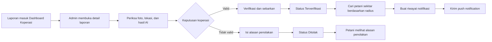

# User Flow Laporan Tanaman Berpotensi Penyakit

## Ringkasan

Dokumen ini menjelaskan perjalanan petani sejak menemukan tanaman yang berpotensi terkena
penyakit, mengambil atau memilih foto, menerima perkiraan awal dari AI, hingga mengirim laporan
ke koperasi untuk diverifikasi.

Hasil AI hanya menjadi perkiraan awal dan tidak menggantikan pemeriksaan langsung oleh penyuluh
atau ahli pertanian.

## Tujuan User Flow

- Memudahkan petani mendokumentasikan gejala tanaman.
- Memberikan perkiraan awal penyakit melalui AI.
- Menghubungkan laporan petani dengan koperasi desa.
- Memastikan petani mengetahui status laporan pada setiap tahap.
- Memungkinkan koperasi memverifikasi laporan sebelum menyebarkan peringatan.

## Aktor

| Aktor | Tanggung Jawab |
| --- | --- |
| Petani | Memilih lahan, mengambil foto, mengisi gejala, dan mengirim laporan. |
| Aplikasi iOS | Menampilkan form, mengirim foto, dan menampilkan status serta hasil AI. |
| Backend FastAPI | Menyimpan foto, menjalankan analisis AI, dan membuat laporan. |
| AI | Memberikan perkiraan awal, confidence score, gejala, dan rekomendasi. |
| Admin koperasi | Memeriksa, memverifikasi, atau menolak laporan. |

## Diagram User Flow Utama

```mermaid
flowchart TD
    A["Petani membuka tab Lapor"] --> B{"Sudah punya lahan aktif?"}

    B -- "Belum" --> C["Tambah atau pilih lahan"]
    C --> D["Isi nama lahan, jenis tanaman, dan lokasi"]
    D --> E["Simpan sebagai lahan aktif"]
    B -- "Sudah" --> F["Pilih sumber foto"]
    E --> F

    F --> G{"Sumber foto"}
    G -- "Kamera" --> H["Ambil foto tanaman"]
    G -- "Galeri" --> I["Pilih foto tanaman"]
    H --> J["Preview foto"]
    I --> J

    J --> K{"Foto sudah jelas?"}
    K -- "Belum" --> F
    K -- "Sudah" --> L["Isi informasi gejala"]

    L --> M["Pilih kategori Penyakit"]
    M --> N["Isi judul dan deskripsi gejala"]
    N --> O["Kirim untuk dianalisis"]

    O --> P["Backend mengunggah foto"]
    P --> Q["AI menganalisis foto tanaman"]

    Q --> R{"Analisis selesai dalam 10 detik?"}
    R -- "Belum" --> S["Tampilkan status Analisis berjalan"]
    S --> T["Aplikasi memeriksa detail laporan"]
    T --> U["Hasil analisis tersedia"]
    R -- "Ya" --> U

    U --> V["Tampilkan perkiraan penyakit"]
    V --> W["Tampilkan confidence, gejala, rekomendasi, dan disclaimer"]
    W --> X{"Petani ingin melapor?"}

    X -- "Belum" --> Y["Simpan pada riwayat petani"]
    X -- "Ya" --> Z["Tap Laporkan ke Koperasi"]

    Z --> AA["Konfirmasi foto, lahan, lokasi, dan ringkasan"]
    AA --> AB{"Konfirmasi kirim laporan"}
    AB -- "Batal" --> W
    AB -- "Kirim" --> AC["Backend membuat laporan desa"]

    AC --> AD["Status Menunggu verifikasi"]
    AD --> AE["Laporan masuk Radar Feed dan Dashboard Koperasi"]
    AE --> AF["Tampilkan konfirmasi laporan berhasil dikirim"]
```



## Detail Alur Petani

### 1. Membuka tab Lapor

Petani membuka tab `Lapor`. Aplikasi menampilkan lahan aktif yang akan digunakan sebagai sumber
lokasi dan konteks tanaman.

Jika petani belum memiliki lahan aktif, aplikasi mengarahkan petani untuk menambahkan atau
memilih lahan terlebih dahulu.

Data minimum lahan:

- Nama lahan.
- Jenis tanaman.
- Nama atau alamat lokasi.
- Latitude dan longitude.

### 2. Memilih sumber foto

Petani dapat memilih salah satu sumber foto:

- `Ambil Foto` untuk membuka kamera.
- `Pilih dari Galeri` untuk menggunakan foto yang sudah tersedia.

### 3. Memeriksa preview foto

Aplikasi menampilkan preview foto dengan dua tindakan:

- `Ambil Ulang` atau `Pilih Foto Lain`.
- `Gunakan Foto`.

Foto sebaiknya memperlihatkan bagian tanaman yang bermasalah secara jelas, tidak terlalu gelap,
dan tidak buram.

### 4. Mengisi informasi gejala

Petani mengisi informasi berikut:

| Field | Ketentuan |
| --- | --- |
| Kategori | Gunakan `Penyakit`. |
| Judul | Wajib, minimal 3 karakter. |
| Deskripsi | Opsional, berisi gejala dan waktu mulai terlihat. |
| Lahan | Menggunakan lahan yang dipilih atau lahan aktif. |
| Lokasi | Otomatis dari lahan, tetapi dapat dikirim dari lokasi perangkat. |

Contoh judul:

> Bercak cokelat pada daun padi

Contoh deskripsi:

> Bercak mulai terlihat sejak tiga hari lalu dan menyebar ke beberapa tanaman.

### 5. Mengirim foto untuk dianalisis

Aplikasi mengirim foto dan metadata menggunakan endpoint berikut:

```http
POST /api/v1/plant-reports
Authorization: Bearer <access_token>
Content-Type: multipart/form-data
```

Form data:

| Field | Isi |
| --- | --- |
| `image` | File JPEG, PNG, atau HEIC dengan ukuran maksimum 10 MB. |
| `title` | Judul laporan. |
| `category` | `Penyakit`. |
| `description` | Deskripsi gejala. |
| `farm_id` | ID lahan aktif atau lahan yang dipilih. |
| `latitude` | Latitude lokasi laporan jika tersedia. |
| `longitude` | Longitude lokasi laporan jika tersedia. |
| `publish_to_feed` | `true` ketika laporan ingin dibagikan. |

Saat upload dan analisis berlangsung, aplikasi menampilkan loading state:

> Sedang memeriksa kondisi tanaman...

### 6. Menangani proses AI

Backend menunggu hasil AI maksimal 10 detik.

Jika analisis selesai dalam 10 detik, response langsung berisi hasil diagnosis awal.

Jika analisis belum selesai, backend mengembalikan:

- `diagnosis: null`
- `status: "Analisis berjalan"`

Aplikasi kemudian memeriksa hasil terbaru melalui:

```http
GET /api/v1/plant-reports/{report_id}
Authorization: Bearer <access_token>
```

### 7. Menampilkan hasil perkiraan awal

Aplikasi menampilkan:

- Perkiraan penyakit.
- Tingkat keyakinan AI dalam rentang `0...100`.
- Gejala yang terdeteksi.
- Rekomendasi penanganan awal.
- Disclaimer AI.

Contoh hasil:

> **Kemungkinan penyakit bercak daun**  
> Tingkat keyakinan: **82%**  
> Daun menunjukkan bercak cokelat pada beberapa area.

Disclaimer wajib ditampilkan:

> Hasil ini merupakan perkiraan awal berbasis AI dan bukan pengganti pemeriksaan langsung oleh
> penyuluh atau ahli pertanian.

### 8. Mengonfirmasi laporan ke koperasi

Petani menekan tombol:

> Laporkan ke Koperasi

Aplikasi menampilkan halaman atau bottom sheet konfirmasi yang memuat:

- Foto tanaman.
- Perkiraan awal AI.
- Confidence score.
- Judul dan deskripsi.
- Nama lahan.
- Lokasi laporan.

Tindakan yang tersedia:

- `Batal` untuk kembali ke hasil analisis.
- `Kirim Laporan` untuk meneruskan laporan ke koperasi.

### 9. Laporan diterima koperasi

Setelah dikirim, laporan memiliki status:

> Menunggu verifikasi

Laporan tersedia pada:

- Riwayat laporan petani.
- Radar Feed dengan label `Menunggu verifikasi`.
- Dashboard koperasi.

Pesan keberhasilan kepada petani:

> **Laporan berhasil dikirim**  
> Koperasi akan memeriksa laporan dan memberikan peringatan kepada petani sekitar jika laporan
> telah diverifikasi.

## Alur Verifikasi Koperasi



Endpoint koperasi:

```http
GET /api/v1/dashboard/reports
GET /api/v1/dashboard/map-reports
POST /api/v1/dashboard/reports/{report_id}/verify-broadcast
POST /api/v1/dashboard/reports/{report_id}/reject
```

### Laporan diverifikasi

Jika laporan valid:

1. Admin menekan `Verifikasi dan Sebarkan`.
2. Status laporan berubah menjadi `Terverifikasi`.
3. Backend mencari lahan petani lain dalam radius yang dipilih.
4. Backend membuat riwayat notifikasi.
5. Backend mengirim push notification melalui FCM.
6. Petani pelapor dan petani sekitar dapat melihat laporan terverifikasi.

### Laporan ditolak

Jika laporan tidak valid:

1. Admin memilih `Tolak Laporan`.
2. Admin wajib mengisi alasan penolakan.
3. Status laporan berubah menjadi `Ditolak`.
4. Laporan tidak lagi ditampilkan pada Radar Feed atau peta publik.
5. Petani dapat melihat alasan penolakan pada riwayat laporan.

## Status Laporan

| Status | Arti | Tindakan Berikutnya |
| --- | --- | --- |
| `Analisis berjalan` | AI belum menyelesaikan analisis. | Aplikasi memeriksa endpoint detail laporan. |
| `Menunggu verifikasi` | Analisis selesai dan laporan sudah masuk koperasi. | Admin koperasi memeriksa laporan. |
| `Terverifikasi` | Laporan dinyatakan valid oleh koperasi. | Backend mengirim peringatan kepada petani sekitar. |
| `Ditolak` | Laporan ditolak oleh koperasi. | Petani melihat alasan penolakan. |
| `Analisis gagal` | AI tidak berhasil menganalisis foto. | Petani mencoba ulang atau mengunggah foto lain. |

## Error dan Recovery Flow

| Kondisi | Respons Aplikasi |
| --- | --- |
| Tidak ada lahan aktif | Arahkan petani untuk memilih atau menambahkan lahan. |
| Foto melebihi 10 MB | Minta petani mengompresi atau memilih foto lain. |
| Format foto tidak didukung | Minta foto JPEG, PNG, atau HEIC. |
| Upload gagal | Pertahankan input form dan tampilkan tombol `Coba Lagi`. |
| AI melewati 10 detik | Tampilkan `Analisis berjalan` dan lanjutkan pengecekan status. |
| AI gagal | Tampilkan pesan ramah dan tindakan `Analisis Ulang`. |
| Token tidak valid | Arahkan petani untuk login kembali. |
| Koneksi terputus | Pertahankan draft lokal sampai petani mencoba kembali. |

## Acceptance Criteria

- Petani tidak dapat membuat laporan tanpa lahan aktif atau `farm_id` yang valid.
- Petani dapat memakai kamera atau galeri sebagai sumber foto.
- Aplikasi menampilkan preview sebelum foto dikirim.
- Backend menerima JPEG, PNG, atau HEIC dengan ukuran maksimum 10 MB.
- AI menghasilkan perkiraan awal dalam Bahasa Indonesia.
- Hasil AI menampilkan confidence score, gejala, rekomendasi, dan disclaimer.
- Proses AI yang melebihi 10 detik tidak menghilangkan laporan.
- Petani harus mengonfirmasi sebelum laporan diteruskan ke koperasi.
- Laporan yang dikirim memiliki status awal `Menunggu verifikasi`.
- Laporan muncul pada Dashboard Koperasi.
- Admin koperasi dapat memverifikasi atau menolak laporan.
- Push notification hanya dikirim setelah laporan diverifikasi.
- Laporan yang ditolak tidak muncul pada Radar Feed atau peta publik.
